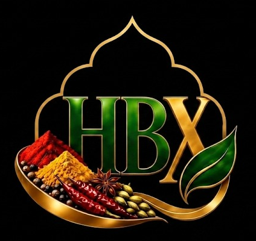

# HBX FOODS — Pure Authentic Spices & Dehydrated Ingredients

<p align="center">
  
</p>

<p align="center">
  <strong>Global Wholesale, B2B Export Catalogue & 20-Ton Container Mix Builder</strong><br>
  <em>Direct farm-gate sourcing from Rajasthan & Gujarat harvest belts to global seaports.</em>
</p>

<p align="center">
  
  
  
  
</p>

---

## 🏛️ Executive Overview

**HBX Foods** is an integrated agro-processing and bulk export company specializing in premium whole spices, optical Sortex-cleaned seeds, cryogenic cold-ground spice blends, and industrial dehydrated vegetables. 

Sourced directly from primary agricultural mandis in Rajasthan (*Bikaner, Jodhpur, Raisinghnagar, Nagaur*) and Gujarat (*Unjha, Gondal*), we supply food manufacturers, private-label packagers, commercial spice blenders, and wholesale importers across North America, the UK, the European Union, and the GCC.

- **Primary Export Standard:** Standard 20 Metric Tons / 20' FCL (or multi-lot consolidated LCL).
- **Processing Controls:** Optical laser sortex grading, steam sterilization, moisture-controlled drying, cryo-grinding (< 40°C).
- **Quality Assurance:** Full Certificate of Analysis (COA) per batch, complete pesticide residue analysis, heavy metal screening, and phytosanitary clearance.
- **Global Coordination Desks:** Mohali (India HQ) • Ontario (Canada) • London (UK) • Sharjah Media City (UAE).

---

## 📦 Export Product Catalog & Technical Parameters

| Category | Primary Varieties | Technical Specifications | Export Packaging Options |
| :--- | :--- | :--- | :--- |
| **01. Dehydrated Ingredients** | White, Pink & Red Onion Flakes; Garlic (Minced, Chopped, Granules, Powder) | Moisture < 5.0%, Sulfur Dioxide Free, Microbial plate count within US-FDA limits | 20kg / 25kg Poly-lined Multi-layer Kraft Bags, Corrugated Cartons |
| **02. Whole & Exotic Spices** | Kashmiri Saffron (Mongra A++), Bold 8mm Alleppey Green Cardamom, Star Anise, Dry Ginger (Sonth), Ceylon Cinnamon | Volatile Oil > 3.5%, Foreign Matter < 0.5%, Extraneous seed pods removed | Nitrogen-flushed cans, Aluminum Barrier Vacuum Packs |
| **03. Sortex Clean Seeds** | 99.95% Hulled White Sesame, Natural Sesame, Cumin Seeds (Jeera), Chia Seeds, Kalonji (Black Cumin) | Optical laser sorted, Purity 99.5% – 99.95%, Salmonella negative in 25g | 25kg / 50kg Food-Grade PP / Paper Bags, Bulk Big Bags (1 MT) |
| **04. Ground Spices & Masalas** | High-Curcumin Turmeric (>3%-5%), Kashmiri Red Chilli Powder, Coriander, Dum Biryani Masala, Garam Masala | Cold-ground (Cryogenic milling), Mesh size 60–100, Free of synthetic azo dyes & Sudan reds | Multi-ply Aluminum Foil Barrier Bags, 25kg Kraft Drums |

---

## 🚢 20-Ton FCL Container Mix Calculator

Bulk international buyers rarely import single items in an entire 20-foot shipping container. To solve this, **HBX Foods** features an interactive **20-Ton Full Container Load (FCL) Builder**:

```
+-------------------------------------------------------------+
|  CONTAINER MIX VISUALIZER                                   |
|  [||||||||||||||||||||||||||||||||||||||||] 20.0 / 20.0 T   |
|  Status: 100% FCL OPTIMIZED (Ready for Seaport Dispatch)   |
|                                                             |
|  • Dehydrated White Onion Flakes    8.0 Tons  [-]  [+]      |
|  • Sortex Clean Cumin Seeds (Jeera) 6.0 Tons  [-]  [+]      |
|  • 99.95% Hulled Sesame Seeds       6.0 Tons  [-]  [+]      |
|                                                             |
|  Buyer: Al-Madina Foodstuffs LLC                            |
|  Port: Port of Jebel Ali (Dubai, UAE)                       |
|  [-> Dispatch Breakdown to WhatsApp Desk]                   |
+-------------------------------------------------------------+
```

### Key Capabilities
- **Tonnage Accumulation:** Tracks cumulative weight in real-time with 0.1 Metric Ton precision.
- **Three Dynamic Load States:**
  - `LCL Mode (< 20T):` Alerts buyer of leftover space to maximize container shipping efficiency.
  - `FCL Mode (= 20T):` Indicates full container utilization for best freight pricing.
  - `Multi-Container Mode (> 20T):` Automatically prompts for 40' High-Cube or multi-container booking.
- **State Persistence:** Preserves selected mixes in browser `localStorage` across page navigation.
- **Automated RFQ Generation:** Converts container selections, destination seaport, and buyer identity into a clean WhatsApp freight quote request with one click.

---

## 📂 Repository File Structure

```
d:/HBX__Foods/
├── index.html              # Main brand landing page & product portfolio showcase
├── dehydrated.html         # Dehydrated onion & garlic product catalog
├── whole-spices.html       # Whole & exotic spices catalog
├── seeds.html              # Sortex clean seeds catalog
├── ground-spices.html      # Ground spices & artisan blends catalog
├── container-bag.js        # Vanilla JS 20-ton container calculation & drawer engine
├── container-bag.css       # Luxury styling tokens & responsive drawer layout
├── images/                 # Product photography, official crests, and media assets
├── docs/                   # Export specifications, compliance & trade guides
├── DEVLOG.md               # Detailed engineering and design development log
├── CHANGELOG.md            # Release version history & feature additions
└── README.md               # Repository documentation and trade manual
```

---

## 🎨 Architectural Design System

The HBX Foods web presence is built on the **Saffron Muse & Noiré Luxury** aesthetic:
- **Matte Espresso (`#12100E`) & Roasted Slate (`#181512`):** Grounded background reminiscent of rich soil and toasted spices.
- **Imperial Gold (`#D4AF37` / `#B8860B`):** Premium accentuation echoing turmeric and saffron value.
- **Plaster Bone (`#F4ECE4`):** Soft, non-glare off-white for editorial typographic clarity.
- **Typography:** *Cormorant Garamond* (Royal Editorial Serif) paired with *Plus Jakarta Sans* (Clean Modern Sans).
- **Responsive Grid:** True 2-column mobile layout and compact viewport hero frames.

---

## 🌐 Supported Ports & International Logistics

We service all major international trade lanes with **FOB (Mundra / Nhava Sheva)** and **CIF / CFR** terms to:
- **Middle East:** Port of Jebel Ali (UAE), Port of Jeddah (Saudi Arabia), Port of Hamad (Qatar).
- **Europe:** Port of Rotterdam (Netherlands), Port of Hamburg (Germany), Port of Felixstowe (UK).
- **Americas:** Port of New York & Newark (USA), Port of Long Beach (USA), Port of Santos (Brazil).
- **Asia-Pacific:** Port of Singapore, Port Klang (Malaysia), Port of Sydney (Australia).

---

## 🚀 Local Development & Preview

Run the catalogue locally with zero build steps or npm installations:

```bash
# Using Python 3 built-in HTTP server
python -m http.server 3000

# Or using Node http-server / npx serve
npx serve .

# Navigate to
http://localhost:3000
```

---

## 📞 Export Desk & Trade Enquiries

- **Official Portal:** [hbxfoods.com](https://hbxfoods.com)
- **India Processing HQ:** 5th Floor Continental Tower, Sector 74, Mohali, Punjab - 160071
- **Direct Trade Desk:** +91 77175-75257 / +1 (541) 395-3999
- **Email:** info@hbxfoods.com
